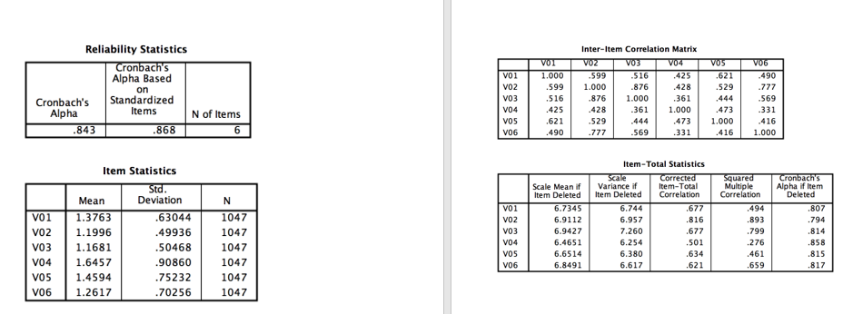

```{r, echo = FALSE, results = "hide"}
include_supplement("vufsw-cronbach'salpha-0025-en.png", recursive = TRUE)
```

Question
========
Suppose we get the following results from a reliability analysis of a 6-item scale. What can we best to do with **item V02**? And why?  


Answerlist
----------
* This item is best **ompolled** (recoded) because the Item-Total Correlation has a value higher than 0.80.
* This item is best **removed** from the scale because the Item-Total Correlation has a value lower than 0.843.
* It is best to **ompose** (recode) this item, because its value is at "Cronbach's Alpha if Item Deleted" is lower than 0.80.
* T is best to **keep this item unchanged in the scale**, because the value at "Cronbach's Alpha if Item Deleted" is lower than 0,843.
* This item is best **removed** from the scale, because its value at "Cronbach's Alpha if Item Deleted" is lower than 0.80.

Solution
========

 all three are correct: diferent sample sizes, significant levels, samples

Answerlist
----------
* False
* False
* False
* True
* False

Meta-information
================
exname: vufsw-cronbach'salpha-0025-en
extype: schoice
exsolution: 00010
exshuffle: TRUE
exsection: reliability/analysis/cronbach's alpha
exextra[ID]: ce341
exextra[Type]: interpretating output
exextra[Program]: NA
exextra[Language]: English
exextra[Level]: statistical reasoning

