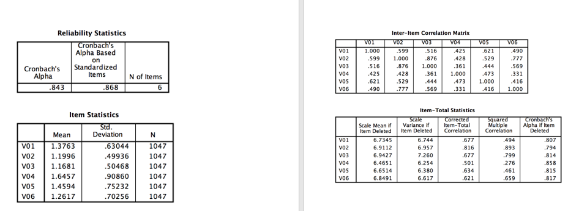

```{r, echo = FALSE, results = "hide"}
include_supplement("vufsw-cronbach'salpha-0025-nl.png", recursive = TRUE)
```

Question
========
Stel, we krijgen de onderstaande uitkomsten bij een
betrouwbaarheidsanalyse van een schaal met 6 items. Wat kunnen we het
beste met **item V02** doen? En waarom?  


Answerlist
----------
* Dit item kunnen we het beste **ompolen** (hercoderen), omdat de
  Item-Total Correlatie een waarde heeft die hoger is dan 0,80.
* Dit item kunnen we het beste uit de schaal **verwijderen**, omdat de
  Item-Total Correlatie een waarde heeft die lager is dan 0,843.
* Dit item kunnen we het beste **ompolen** (hercoderen), omdat de waarde
  bij “Cronbach’s Alpha if Item Deleted” lager is dan 0,80.
* Dit item kunnen we het beste ongewijzigd in de schaal **behouden**,
  omdat de waarde bij “Cronbach’s Alpha if Item Deleted” lager is dan
  0,843.
* Dit item kunnen we het beste uit de schaal **verwijderen**, omdat de
  waarde bij “Cronbach’s Alpha if Item Deleted” lager is dan 0,80.

Solution
========


 all three are correct: diferent sample sizes, significant levels,
samples


Answerlist
----------
* False
* False
* False
* True
* False

Meta-information
================
exname: vufsw-cronbach'salpha-0025-nl
extype: schoice
exsolution: 00010
exshuffle: TRUE
exsection: reliability/analysis/cronbach's alpha
exextra[Type]: interpretating output
exextra[Program]: NA
exextra[Language]: Dutch
exextra[Level]: statistical reasoning

