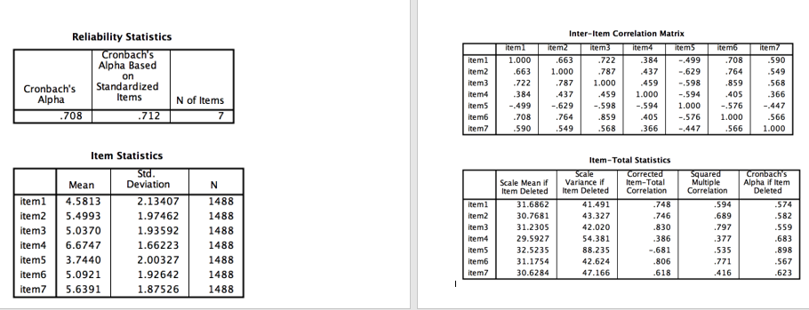

```{r, echo = FALSE, results = "hide"}
include_supplement("vufsw-cronbach'salpha-0026-en.png", recursive = TRUE)
```

Question
========
Suppose we get the following results from a reliability analysis of a scale with 7 statements. What can we best to do with **item5**? And why?  


Answerlist
----------
* This item is best left unchanged in the scale **retained**, because the value at "Cronbach's Alpha if Item Deleted" is higher than 0,80.
* This item is best **removed** from the scale because the Item-Total Correlation has a high negative value.
* This item is best **ompolled** (recoded), because the Item-Total Correlation has a high negative value.
* We can best **standardize** this item, because the z-score of item5 will thus have a high positive Item-Total Correlation.
* It is best to **remove** this item from the scale, because the value at "Cronbach's Alpha if Item Deleted" is higher than 0.80.

Solution
========

all three are correct: diferent sample sizes, significant levels, samples

Answerlist
----------
* False
* False
* True
* False
* False

Meta-information
================
exname: vufsw-cronbach'salpha-0026-en
extype: schoice
exsolution: 00100
exshuffle: TRUE
exsection: reliability/analysis/cronbach's alpha
exextra[Type]: interpretating output
exextra[Program]: NA
exextra[Language]: English
exextra[Level]: statistical reasoning

