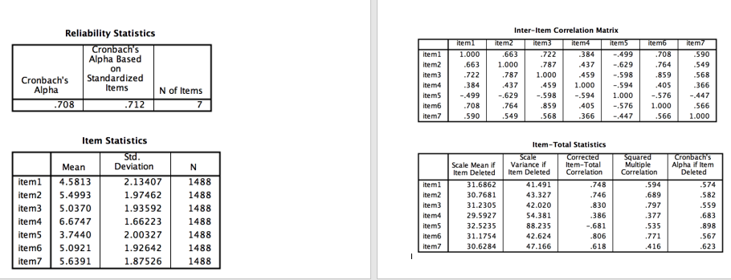

```{r, echo = FALSE, results = "hide"}
include_supplement("vufsw-cronbach'salpha-0026-nl.png", recursive = TRUE)
```

Question
========
Stel, we krijgen de onderstaande uitkomsten bij een
betrouwbaarheidsanalyse van een schaal met 7 stellingen. Wat kunnen we
het beste met **item5** doen? En waarom?  


Answerlist
----------
* Dit item kunnen we het beste ongewijzigd in de schaal **behouden**,
  omdat de waarde bij “Cronbach’s Alpha if Item Deleted” hoger is dan
  0,80.
* Dit item kunnen we het beste uit de schaal **verwijderen**, omdat de
  Item-Total Correlatie een hoge negatieve waarde heeft.
* Dit item kunnen we het beste **ompolen** (hercoderen), omdat de
  Item-Total Correlatie een hoge negatieve waarde heeft.
* Dit item kunnen we het beste **standaardiseren**, omdat de z-score van
  item5 zodoende een hoge positieve Item-Total Correlatie zal hebben.
* Dit item kunnen we het beste uit de schaal **verwijderen**, omdat de
  waarde bij “Cronbach’s Alpha if Item Deleted” hoger is dan 0,80.

Solution
========


all three are correct: diferent sample sizes, significant levels,
samples


Answerlist
----------
* False
* False
* True
* False
* False

Meta-information
================
exname: vufsw-cronbach'salpha-0026-nl
extype: schoice
exsolution: 00100
exshuffle: TRUE
exsection: reliability/analysis/cronbach's alpha
exextra[ID]: 604b7
exextra[Type]: interpretating output
exextra[Program]: NA
exextra[Language]: Dutch
exextra[Level]: statistical reasoning

