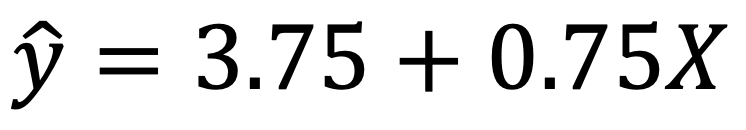

```{r, echo = FALSE, results = "hide"}
include_supplement("vufsw-cronbach'salpha-0090-nl.png", recursive = TRUE)
```

Question
========
Een onderzoeker heeft een regressie-analyse uitgevoerd om iemands
interesse in politiek (Y) te voorspellen <span
class="tvcss_2 tvcss_3 tvcss_4 tvcss_5 tvcss_6 tvcss_7">op basis van hoe
vaak iemand per week nieuwsartikelen leest (X). </span>Politieke
interesse is gemeten met een schaal die loopt van 1 (‘helemaal niet
geïnteresseerd’) tot 10 (<span
class="tvcss_2 tvcss_3 tvcss_4 tvcss_5 tvcss_6 tvcss_7">‘</span>zeer
geïnteresseerd’). De formule die bij de regressielijn hoort staat
onderaan de vraag.  
  
Voor de meting van politieke interesse heeft de onderzoeker een schaal
ontwikkeld die uit 10 items bestaat. Ze wil weten of dit een betrouwbare
schaal is. Ze vindt bij een willekeurige steekproef van 231 respondenten
dat de gemiddelde correlatie tussen de items 0,512 is. Als we aannemen
dat de varianties van de 10 items hetzelfde zijn, hoe hoog is de
Cronbach's Alpha?   
  


Answerlist
----------
* 0,913
* 0,837
* 0,888
* 0,996

Solution
========


Answerlist
----------
* True
* False
* False
* False

Meta-information
================
exname: vufsw-cronbach'salpha-0090-nl
extype: schoice
exsolution: 1000
exshuffle: TRUE
exsection: reliability/analysis/cronbach's alpha
exextra[ID]: 7e087
exextra[Type]: performing analysis
exextra[Program]: calculator
exextra[Language]: Dutch
exextra[Level]: statistical thinking

