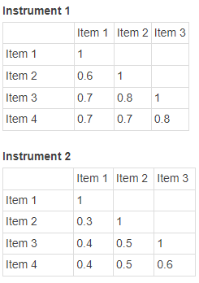

```{r, echo = FALSE, results = "hide"}
include_supplement("1645518804011.png", recursive = TRUE)
```

Question
========
De correlaties tussen de items van twee meetinstrumenten zijn als volgt als volgt:  
  

  
Van welk meetinstrument zal de interne consistentie van de schaal (de Cronbach's alpha) hoger zijn?

Antwoordlijst
----------
* De Cronbach's alpha van meetinstrument 1 is hoger.
* De Cronbach's alpha van meetinstrument 2 is hoger.
* De Cronbach's alpha's van beide meetinstrumenten zijn even hoog.
* Op basis van deze informatie is het niet mogelijk om te bepalen welke Cronbach's alpha hoger is.

Solution
========

De Cronbach's alpha van instrument 1 is hoger. Omdat de items hoger gecorreleerd zijn.

Taal Nederlands

Moeilijkheidsniveaus Gemakkelijk

M&T BIS Standaardwaarde

M&T Betrouwbaarheid Standaardwaarde
Antwoordlijst
----------
* Waar
* Onwaar
* Onwaar
* Onwaar

Meta-information
================
exname: vufsw-cronbach'salpha-1248-nl
extype: schoice
exsolution: 1000
exshuffle: TRUE
exsection: reliability/analysis/cronbach's alpha
exextra[Type]: conceptual
exextra[Program]: NA
exextra[Language]: Dutch
exextra[Level]: statistical reasoning

